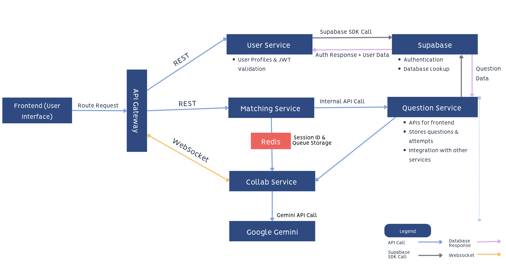
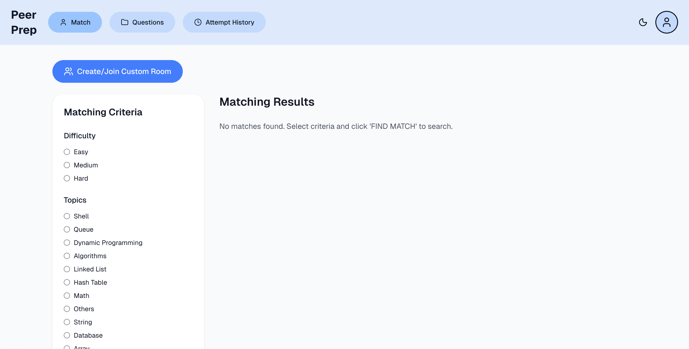
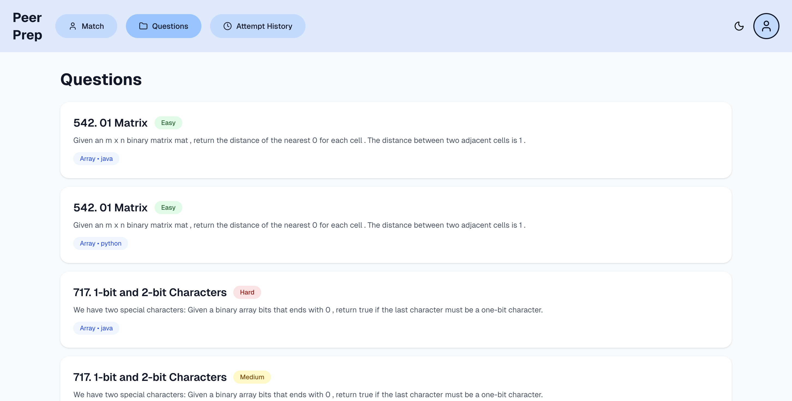
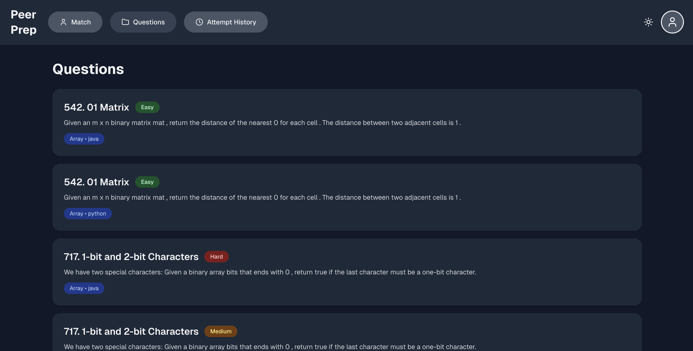

[](https://classroom.github.com/a/QUdQy4ix)

# CS3219 Project (PeerPrep) - AY2526S1

## Group: G10

### Note:

- You are required to develop individual microservices within separate folders within this repository.
- The teaching team should be given access to the repositories as we may require viewing the history of the repository in case of any disputes or disagreements.

---

## Overview

PeerPrep is a web-based platform that allows users to solve coding problems with real-time collaboration.

## Services and Features

### User Service

The User Service is responsible for managing user accounts, authentication, and authorization within the PeerPrep platform. It serves as the central entry point for all user-related operations, ensuring secure and consistent identity management across microservices.

#### **Core Responsibilities:**

- Handle **user registration**, **login**, and **logout** securely through Supabase Authentication
- Manage **user profiles**, including fetching, updating, and deleting account data
- Generate and validate **JWT tokens** for authenticated routes
- Integrate with other microservices (e.g., Matching and Collaboration) to verify user identity before granting access
- Provide **email confirmation** and **password recovery** flows via Supabase’s built-in Auth API

---

#### **Tech Stack:**

- **Node.js + Express.js** – Core backend framework for route handling and middleware
- **Prisma ORM** – Simplifies database queries and migrations
- **PostgreSQL (via Supabase)** – Stores user data securely in a managed environment
- **Supabase Auth** – Provides built-in authentication, email verification, and password reset
- **JWT (JSON Web Token)** – Used for access control and user session validation

---

#### **Integration Details:**

- Connected to frontend login & signup pages through RESTful API calls
- Tokens generated here are attached to requests sent to Matching and Collaboration services for verification
- Includes error handling and validation middleware for consistent API responses

### Question Service

### Matching Service

The Matching Service automatically pairs users seeking a partner for coding sessions based on their selected difficulty and (preferably) topic. It uses Redis for queue management and temporary match/session storage, enabling fast, stateless matching between users.

#### **Mechanism**

1. When a user clicks “Find a Partner”, they are temporarily added to a Redis queue (waitingUsers).
2. The service continuously checks for another user with: the same difficulty, and ideally the same topic.
   2a. If a compatible user is found → a match is created for both users.
   2b. If no match is found within 60 seconds, the user is automatically removed to avoid stale entries.

#### **Architecture & Flow**

1. **User sends a match request** → backend checks Redis queue.
2. If the user is **not already in a match**, they are added to the `waitingUsers` queue (FIFO).
3. The service filters waiting users by:
   - Same **difficulty**, then
   - Same **topic** (if available).
4. When a suitable partner is found:
   - Two Redis keys are created:
     ```
     match:UserA → details of UserB
     match:UserB → details of UserA
     ```
   - Both users receive a **match result**.
5. Clients poll every few seconds until `matchFound = true`.
6. Once both users confirm, the backend:
   - Verifies both `match:` entries exist and point to each other.
   - Creates session entries (valid for **1 hour**):
     ```
     session:UserA
     session:UserB
     ```
   - Deletes temporary match keys.
   - Returns the shared `sessionId` to both clients.

#### **Integration with Collaboration Service**

Once both users confirm the match:

    Redis stores session metadata:
    ```json
    session:UserA = {
    "sessionId": "session-xyz",
    "partnerId": "UserB",
    "createdAt": 1730220000000
    }

The Collaboration Service retrieves this sessionId to connect both users into a shared real-time code editor.

#### **Design Decisions**

- **Stateless Scaling:** All temporary state stored in Redis → resilient even if servers restart.
- **Fast Matching:** O(1) Redis list lookups enable high-frequency polling.
- **Frontend Friendly:** Clients poll every 3 seconds for continuous updates.
- **Error Tolerant:** Auto-expiring keys (60 s) handle cleanup automatically.
- **Easy Integration:** Collaboration service only requires the sessionId to create a shared room.

#### **Technologies**

- **Node.js / Express** — API server
- **Redis** — queue, match, and session storage
- **Axios / WebSocket** — frontend communication (polling + updates)

#### **Edge Cases**

| **Scenario**                         | **Handling**                                                                  |
| :----------------------------------- | :---------------------------------------------------------------------------- |
| **User goes offline mid-match**      | Redis keys expire automatically after 60 s → partner re-queues automatically. |
| **User spams “Find Match”**          | Checks if `userId` already exists in queue → duplicates ignored.              |
| **Users confirm at different times** | Both must have matching Redis entries; otherwise, the match fails gracefully. |
| **Redis crash / restart**            | Safe — all data is transient, so users can simply retry.                      |
| **User cancels match**               | `/cancelMatching` removes the user from queue and deletes match keys.         |
| **User refreshes browser**           | Frontend polls `/startMatching` and reuses existing Redis match key.          |
| **Timeout (no match in 60 s)**       | User removed from queue → returns “Match timeout” to frontend.                |

### Collaboration Service

### Live Chat

### Question Attempt History

### Custom Matching Rooms
Users can create or join custom rooms to collaborate with friends.

**Custom Room Creation:**
1. User navigates to the matching page.
2. User clicks `Create/Join Custom Room` button.
3. User clicks `Create Room` button.
4. User selects difficulty and topic of choice, then sets a room password.
5. User clicks `Create Room` button.
6. Room code is displayed to the user.
7. User is redirected to the custom room collaboration page.

**Joining a Custom Room:**
1. User navigates to the matching page.
2. User clicks `Create/Join Custom Room` button.
3. User clicks `Join Room` button.
4. User enters room code and password.
5. User clicks `Join Room` button.
6. User is redirected to the custom room collaboration page.

### AI Assisted Problem-Solving and Chatbot (Google Gemini Integration)

The **AI-Assisted Problem-Solving Chatbot** enhances PeerPrep’s collaborative coding experience by integrating **Google Gemini**, an advanced large language model that provides intelligent hints, explanations, and debugging support in real time.  
It allows users to ask contextual questions about coding problems while working together on solutions within the live collaboration editor.

---

#### **Core Responsibilities**

- Integrate **Google Gemini API** for contextual, AI-powered problem-solving assistance
- Process user queries using combined context: **problem description**, **current code**, and **user prompt**
- Provide **concise, well-formatted explanations** (limited to ~1500 characters for readability)
- Maintain a **floating chatbox UI** within the collaboration page for continuous interaction
- Display helpful statuses such as _“Please wait... Gemini is working”_ while responses are generated
- Gracefully handle downtime with a fallback message: _“⚠️ Gemini is unavailable right now”_

#### **Integration Details**

| Component                | File                                                   | Description                                  |
| ------------------------ | ------------------------------------------------------ | -------------------------------------------- |
| **Backend Route**        | `collab-service/app/routes/ai-routes.js`               | Forwards chat prompts to Google Gemini API   |
| **Frontend Component**   | `frontend/collaboration/components/gemini-chatbot.tsx` | Floating chatbox that interacts with users   |
| **Service Layer**        | `frontend/services/chatbot/aiService.ts`               | Sends question, code, and prompt to backend  |
| **Environment Variable** | `.env`                                                 | Stores the Gemini API key for backend access |

---

#### **How It Works**

1. The user clicks the **Gemini logo button** in the collaboration editor.
2. The **floating AI Assistant chatbox** opens, showing previous message history.
3. When the user sends a query (e.g., _“Can you give me a hint?”_), the following happens:
   - Frontend sends a POST request to `/ai/chat` with:
     ```json
     {
       "question": "Validate Sudoku board",
       "code": "def isValidSudoku(board): ...",
       "prompt": "Can you give me a hint?"
     }
     ```
   - The backend (`ai-routes.js`) forwards this to:
     ```
     https://generativelanguage.googleapis.com/v1beta/models/gemini-1.5-flash:generateContent
     ```
   - Gemini processes the query and returns a concise, formatted response.
   - The response is displayed in the chatbox UI.
4. If the API call fails, the message _“⚠️ Gemini is unavailable right now”_ is shown instead.

---

#### **Example Response**

```json
{
  "reply": "You can use a Set to track duplicates in each row, column, and 3x3 sub-grid. Try iterating through the board and check if the number already exists before adding it."
}


### API-Gateway

The API Gateway is a self-hosted Express.js gateway that consolidates all service endpoints behind a single access point. The gateway handles authentication, routing, and traffic control before forwarding requests to internal services. As the project scales with more services, it helps to simplify communication and improve scalability.

#### **Design Decisions**

- **Gateway Type:** Express.js for full control over middleware, security and integration flexibility
- **Routing Rules:**
  - '/users' -> User Service
  - '/questions' -> Question Service
  - '/match' -> Matching Service
  - '/collab' -> Collaboration Service
- **Authentication:** Middleware validates JWTs before forwarding protected requests
- **Rate Limiting:** Implemented 100 requests / 15 minutes per IP to prevent abuse or spam of requests
- **CORS:** Enabled globally to allows frontend requests
- **Health Check:** `/healthz` endpoint to verify gateway service, health checks and uptime monitoring

- **Future Enhancements:** Load Balancing - can integrate load balancing logic or connect with container orchestration tools e.g., Kubernetes to evenly distribute requests.
- **Challenges faced:** Configuring routing rules correctly across multiple microservices, especially for Question fetching service

#### **Technologies**

- `Express.js` – Server framework
- `express-http-proxy` – Request forwarding
- `jsonwebtoken` – JWT verification
- `express-rate-limit` – Request throttling
- `cors` – Cross-origin support

---

## Tech Stack

### Languages & Frameworks

- **Node.js** (JavaScript runtime) – to run backend code
- **Express.js** – to define routes, handle middleware, and create REST APIs
- **React + Next.js** – frontend

### Database Layer

- **PostgreSQL** – database used
- **Supabase** – host PostgreSQL database

### Authentication & Security

- **JWT** (JSON Web Token) – for session handling and user authentication
- **Supabase Auth** – for signup, login, password reset, etc.

---

## Architecture Diagrams



---

## Screenshots





---
